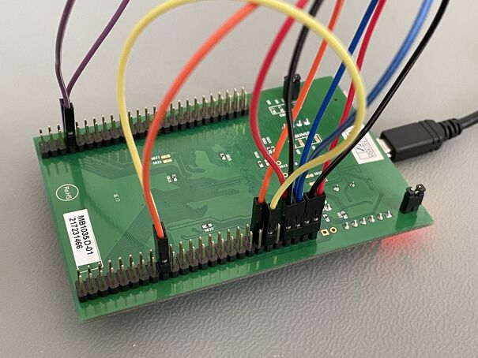

# `stm32f3xx-hal` Test Suite

## Setup

Tests are run via the integration test pattern and are executed on a target
chip, rather than on a host system. First, install
[probe-rs](https://crates.io/crates/probe-rs) via

```sh
cargo install probe-rs --features cli
```

Currently the tests are written for the `stm32f303xc` with the STM32F3Discovery
Board in mind. They expect that several pins are wired together as hinted in
[`src/lib.rs`](src/lib.rs).



## Running Tests

Once you have set up the tooling and wired-up the board, you can execute the
tests via:

```bash
cargo test -p testsuite
```

This will execute all tests sequentially on the target device.

The result _always_ shows a backtrace, even in the case of success.
Exit code of 0 means that the run was successful.

### Using a different board

To run the tests on a different target than the STM32F3Discovery's
`stm32f303xc`, specify a target as a feature:

```bash
cargo test -p testsuite --no-default-features --features stm32f3xx-hal/stm32f301xb
```

If the wiring is different for your board, adjust the type definitions in
`src/lib.rs`.

### Running a single test

Single test of the testsuite can be run, with the `cargo-test` familiar syntax.

```bash
cargo test -p testsuite --test uart
```
